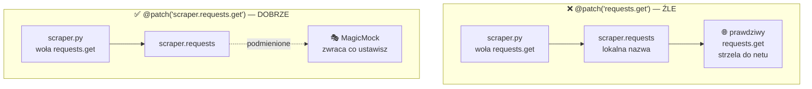
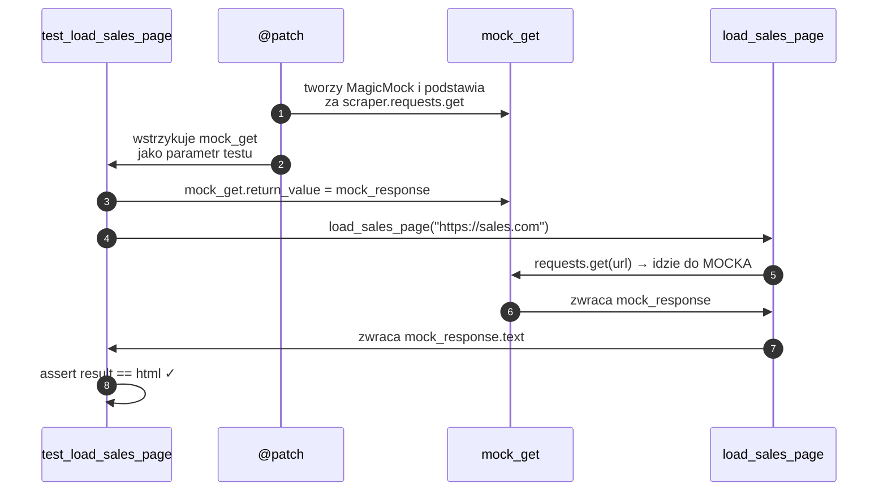
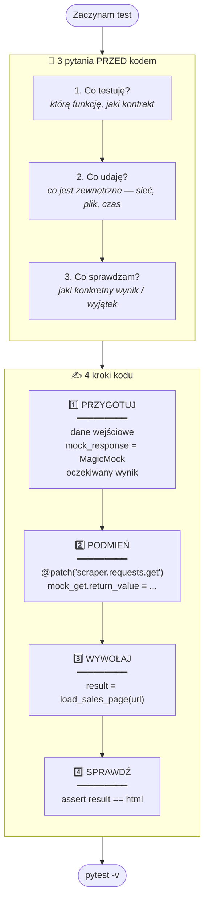
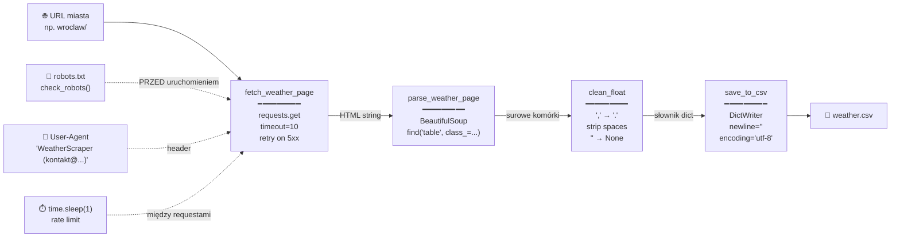
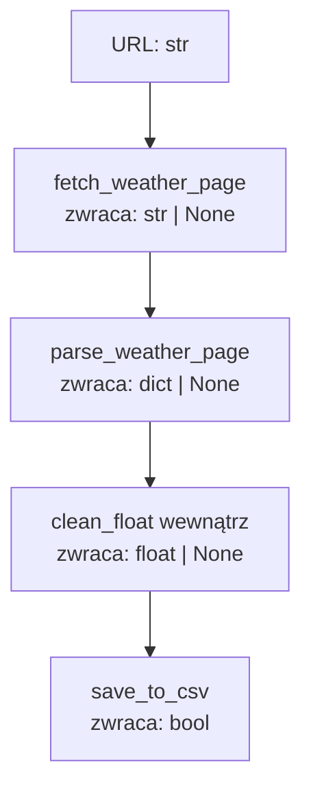

# Pytest & Scraper — Cheatsheet wizualny

> Cztery diagramy, które rozwiązują 80% pomyłek juniora przy testach i scraperach.
> Każdy diagram + krótka legenda + typowa pułapka.

**Spis:**
1. [`@patch` — co się gdzie podmienia](#1-patch--co-się-gdzie-podmienia)
2. [Test pytest — 3 pytania + 4 kroki](#2-test-pytest--3-pytania--4-kroki)
3. [Fixtures — `scope` i cykl życia](#3-fixtures--scope-i-cykl-życia)
4. [Scraper pipeline — Twój `scraper.py`](#4-scraper-pipeline--twój-scraperpy)

---

## 1. `@patch` — co się gdzie podmienia

**Reguła:** patchujesz tam, gdzie moduł **importuje**, NIE tam, gdzie funkcja **żyje**.

### Dlaczego to ma znaczenie

Gdy `scraper.py` robi `import requests`, Python tworzy lokalną nazwę `scraper.requests` wskazującą na bibliotekę. `@patch` podmienia tę lokalną nazwę — nie samą bibliotekę. Jeśli patchujesz `requests.get`, kod ze `scraper.py` i tak woła swoją lokalną kopię, którą wciąż wskazuje na prawdziwy `requests`.

### Diagram porównawczy



### Co się dzieje w trakcie testu — sekwencja



### Typowe pułapki

- 🔴 `@patch("requests.get")` — patchuje bibliotekę, ale kod wciąż używa swojej lokalnej referencji. Mock nigdy nie odpali.
- 🔴 Brak `mock_response.raise_for_status.return_value = None` — `raise_for_status` to **metoda**, nie atrybut. Bez tego mock zwróci kolejny MagicMock, co czasem działa przypadkiem, czasem nie.
- 🟡 Patchowanie `os.path` zamiast `module.os.path` — ta sama reguła co z `requests`.

---

## 2. Test pytest — 3 pytania + 4 kroki

**Reguła:** zanim napiszesz pierwszą linię testu — odpowiedz na 3 pytania. Potem pisz w 4 krokach. Zawsze tej samej kolejności.

### Diagram



### Klucz: nie każdy test potrzebuje wszystkich 4 kroków

- `clean_float("18 500,50")` → **brak kroku 2** (nic nie woła z zewnątrz). Tylko przygotuj → wywołaj → sprawdź.
- `save_to_csv(data, tmp_path / "out.csv")` → **`tmp_path` zamiast `@patch`** (pytest sam podstawi katalog tymczasowy).
- `load_sales_page(url)` → **wszystkie 4 kroki** (woła `requests.get`).

### Typowe pułapki

- 🔴 Pomijanie kroku 1: hardkodowanie magicznych wartości w `assert` zamiast w sekcji przygotuj.
- 🔴 Mockowanie funkcji, która niczego z zewnątrz nie woła. `parse_weather_page(html)` dostaje gotowy string — **nie potrzebuje `@patch`**.
- 🟡 Asercja na cały słownik gdy chcesz sprawdzić jeden klucz. Lepiej `assert result["temperatura"] == 14.5`.

---

## 3. Fixtures — `scope` i cykl życia

**Reguła:** `scope` mówi, **jak często** fixture się odpala. Im węższy scope, tym czystszy stan między testami — ale tym wolniej.

### Diagram cyklu życia

```mermaid
flowchart TB
    subgraph FUNC["scope='function' — domyślny"]
        FF1[setup] --> FT1[test_a]
        FT1 --> FT1d[teardown]
        FT1d --> FF2[setup]
        FF2 --> FT2[test_b]
        FT2 --> FT2d[teardown]
        FT2d --> FF3[setup]
        FF3 --> FT3[test_c]
        FT3 --> FT3d[teardown]
    end
    
    subgraph MOD["scope='module' — raz na plik"]
        MF1[setup] --> MT1[test_a]
        MT1 --> MT2[test_b]
        MT2 --> MT3[test_c]
        MT3 --> MTd[teardown]
    end
    
    subgraph SES["scope='session' — raz na całe pytest"]
        SF1[setup] --> SALL[wszystkie testy<br/>we wszystkich plikach]
        SALL --> SD[teardown<br/>po wszystkim]
    end
```



### Kiedy który scope

| Scope | Kiedy używać | Przykład |
|-------|--------------|----------|
| `function` | tani setup, każdy test musi mieć czysty stan | tymczasowy słownik, mock |
| `module` | drogi setup (połączenie z bazą), testy w pliku mogą dzielić | klient API, plik testowy |
| `session` | bardzo drogi setup, niezmienialny stan | dane referencyjne, Docker container |

### Typowe pułapki

- 🔴 `scope="module"` na fixture, która zwraca **mutowalny obiekt** (lista, dict). Test 1 doda element, test 2 go zobaczy. Niezależność testów łamie się po cichu.
- 🔴 Fixture w `test_*.py` zamiast w `conftest.py` — wtedy widać ją tylko w tym pliku. Współdzielone fixtury **muszą** iść do `conftest.py`.
- 🟡 `autouse=True` „bo wygodnie" — odpala fixture w testach, które jej nie potrzebują. Trudniej zrozumieć skąd się bierze stan.

---

## 4. Scraper pipeline — Twój `scraper.py`

**Reguła:** każdy scraper to ten sam łańcuch. Etyka i higiena to nie ozdoby — to obowiązkowe warstwy obok przepływu danych.

### Diagram



### Co tu jest jakim typem



Kontrakt jednolity: **typ albo `None`**, nigdy string jako sygnał błędu. To pozwala robić early return w łańcuchu:

```python
html = fetch_weather_page(url)
if html is None:
    return False
data = parse_weather_page(html)
if data is None:
    return False
return save_to_csv(data, path)
```

### Typowe pułapki

- 🔴 Brak `check_robots()` przed scrape — klient/strona ma prawo Cię zablokować.
- 🔴 Brak `timeout=` w `requests.get` — scraper wisi w nieskończoność na padniętej stronie.
- 🟡 Brak `time.sleep` między miastami — szybki strzał 50 requestów = błyskawiczny ban IP.
- 🟡 `encoding="cp1250"` zamiast `utf-8` przy zapisie — polskie znaki wyświetlą się jako krzaki w pandas.

---

## Jak używać tego cheatsheetu

1. **Przed napisaniem testu** — sekcja 2. Zatrzymaj się, odpowiedz na 3 pytania.
2. **Gdy mock nie działa** — sekcja 1. Sprawdź ścieżkę patcha.
3. **Gdy testy się wzajemnie psują** — sekcja 3. Sprawdź `scope`.
4. **Przy nowym scraperze** — sekcja 4. Trzymaj się tych warstw.

**Wrzuć ten plik do swojego repo jako `docs/pytest-cheatsheet.md`** — Mermaid wyrenderuje się natywnie na GitHubie. To dobry sygnał dla rekrutera, że dokumentujesz to, czego się nauczyłeś.
